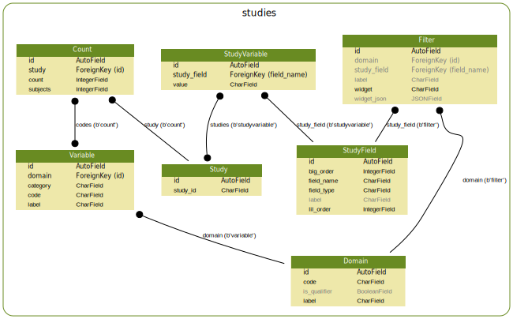

.. _models:

Models
======

The Study Explorer is built on a small number of models. In this
section we will explore the role of each of the models, how they are
populated and how they relate to each other.

    An overview of the relationship between the data catalogue models.

Auto-configured models
++++++++++++++++++++++

As described in the importing data section, most models in Study
Explorer are auto-populated when import data from the study index or
metadata files.

.. _study:

Study
-----

The `Study`_ model is the most basic model and is defined simply by a
unique ``study_id``. The `Study`_ may then be associated with any
number of `StudyVariable`_ and `Count`_ models, which provide more
detail about the study and the kinds of observations it contains.

.. _study_variable:
  
StudyVariable
-------------

The `StudyVariable`_ associates a value for a particular `StudyField`_
with a specific study making it possible to query for studies by the
`StudyVariable`_ models associated with it.

.. _variable:

Variable
--------

A `Variable`_ defines a specific code and label associated with a
particular `Domain`_. In other words it defines all the possible
options for each domain just as the `StudyVariable`_ defines all the
valid options for a `StudyField`_. `Variable`_ models are repopulated
every time the aggregate metadata is loaded and do not need to be
customized manually.

.. _count:

Count
-----

A `Count`_ defines the actual observation count with a combination of
domain and qualifier variables for a particular study. A `Count`_
therefore references the `Study`_ it refers to, a number of codes
(i.e. Variable models) describing what the count is refering to and
then separate counts for the number of observations and the number of
studies.

User-configured models
++++++++++++++++++++++

.. _study_field:

StudyField
----------

A `StudyField`_ defines the various fields that may be imported from a
study index file. `StudyField`_ models are generated automatically on
import but once they have been imported they can be customized in a
number of ways. The fields available for customization include the

* ``label``: A custom label defining how the `StudyField`_ appears in
  the UI.
* ``field_type``: The type of the values stored by this field, valid
  options include ``float``, ``int``, ``str`` and ``list``.
* ``big_order``: Defines the ordering in the study filter view.
* ``lil_order``: Defines the ordering in the study list view.

Unlike the `Domain`_ and `Filter`_ models the `StudyField`_ models are
created automatically when import the study index, however they can
also be configured to set the ``field_type`` controlling the type of
the values that are stored and the ``big_order`` and ``lil_order``
which control which study fields are shown on the :ref:`study_filter`
and :ref:`study_list` page respecively. To see how to configure these
options see the :ref:`configuring_study_fields` section.

.. _domain:

Domain
------

A `Domain`_ defines an overarching category to group multiple
`Variable`_ models into. A `Domain`_ may encompass both primary
observations and so called qualifiers, which provide additional
information about a set of observations.

To see how to configure the `Domain`_ model see the
:ref:`defining_domains` section.

.. _filter:

Filter
------

The `Filter`_ model defines, which study fields, domains and
qualifiers a user can actually filter on in the study filter. The
`Filter`_ defines the ``domain`` or ``study_field`` to filter on along
with some options to customize the widget used for filtering.

To see how to configure the `Filter`_ model see the
:ref:`defining_filters` section.
