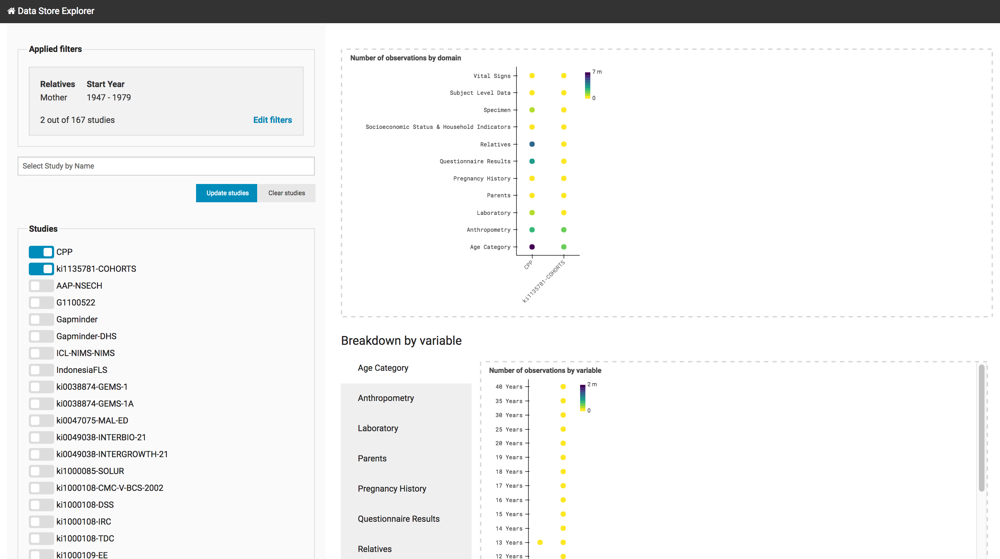
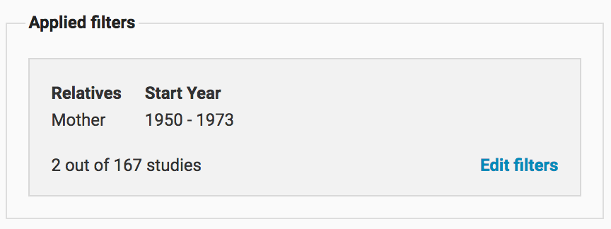
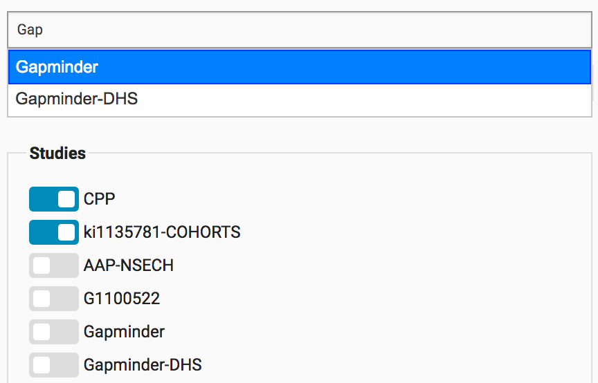

..  _study_explorer:

Study Explorer
==============

The study explorer page allows exploring the observations associated
with the currently selected studies. The selected studies may be
carried over from the :ref:`study_filter` page or be selected
directly.

    Overview of the study explorer page

Applied filters
---------------

If you have transitioned from the study filter view the applied
filters panel will display the filters that have narrowed down the
current list of studies. You can return to the :ref:`study_filter`
page by clicking ``Edit filters``. If you add or remove any studies
the existing filters will be dropped.

			   

Selecting studies
-----------------

The study explorer includes a form to select the current studies. You
can search for the selected studies in the search field. Selecting a
study from the autocompletion dropdown will automatically select the
study.

Observation count visualizations
--------------------------------

The main component of this page are the various summary heatmaps that
provide overviews about the kinds and number of observations
associated with the selected studies. The heatmaps simply represent
the number of observations associated with each combination of
variables along the x- and y-axes.

Observations by domain
**********************

The first plot you will see simply summarizes the number of
observations associated with each study and each domain. Providing a
quick overview of the kinds of observations that are contained within
each of the studies.

Breakdown by variable
*********************

The breakdown by variable section drills down further and looks at the
observation counts broken down by the variables in each :ref:`domain`
and for a number of qualifiers.

Breakdown by age
****************

The breakdown by age on the other hand disaggregates by variable, age
and each individual study. While the variables and age are indexed
along the axes the studies are broken out into individual points,
which lets us see both the number of studies associated with each
combination of variable and age but also the number of observations
associated with each of these studies. Usually the color of the
background square in this plot represents the total number of
observations. However when more than 16 studies are shown the points
for each study are hidden and the opacity of the background square
represents the number of studies.
