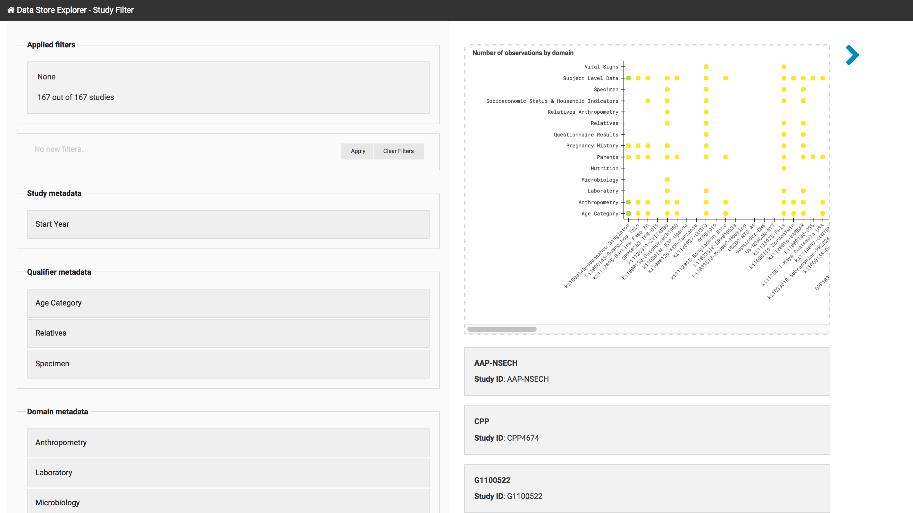
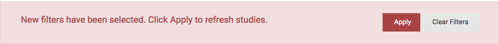
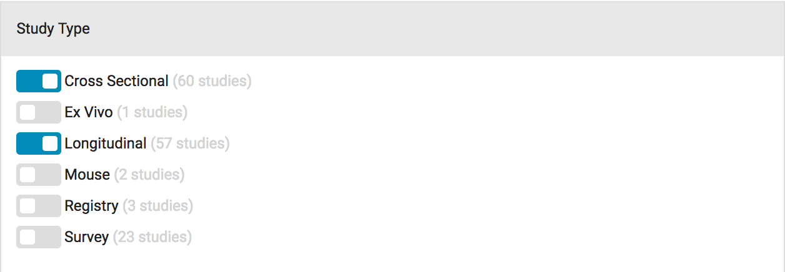
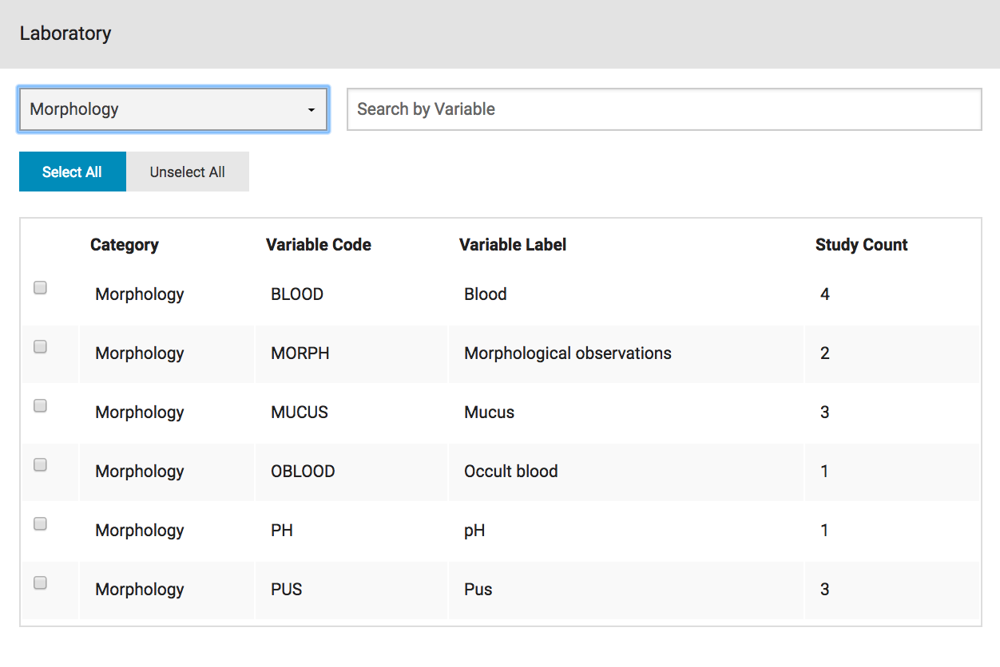
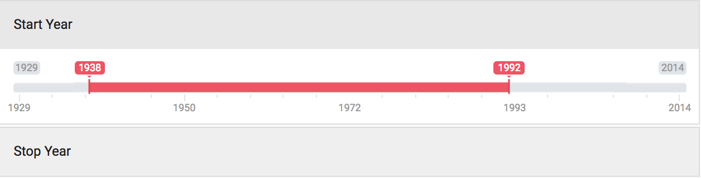
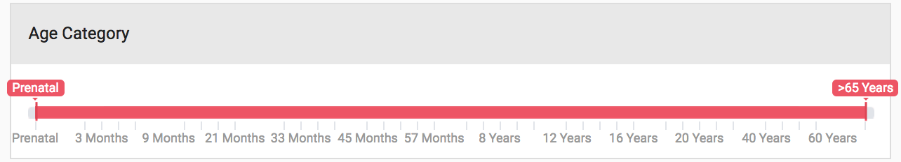

..  _study_filter:

Study Filter
============

The Study Filter view allows querying the indexed studies by the study
fields, domains, or qualifiers associated with them. The page consists
of three main panels: the filtering form panel on the left, a summary
plot of all selected studies on top, and below, basic descriptions of
each of the selected studies.

    Study Filter page with three main panels: 1) applied filters
    listed on the top left 2) expandable filters on the sidebar, 3) a
    summary plot on the top and 4) the list of studies and their
    attributes on the right.

Filtering logic
---------------

The study filters works based on two very simple rules:

1) For each domain, qualifier or study field filter select studies
   which match any of the selected variables (equivalent to logical OR
   statement).
2) Across all domain, qualifier and study field filters select studies
   which match all of the filters (equivalent to logical AND statement).

In other words for each variable within one domain, qualifier or study
field combine queries with an OR operator and across variables combine
queries with an AND operator.

Using the filter
----------------

Applying filters is very straightforward, simply click on the variable
you want to filter to expand the accordion, bringing the filter widget
into view. Once you have made a selection on a widget the page will
notify you to apply the selection:

Widget Types
------------

The Filter model allows choosing from a number of widget types.

Checkboxes
++++++++++

Checkboxes allow selecting one or more variables for a particular
study field, domain or qualifier. Will filter for studies matching any
of the selected checkboxes.

Domain filters
**************

Since a :ref:`domain` often defines a long list of variables it is
often useful to narrow down the selection. Depending on the domain you
can filter on category and by searching for specific codes and
labels. Applying either of these filters will automatically filter the
table of variables making it easier to select exactly the variables
you are interested in. ``Select all`` and ``unselect all`` buttons
make it easier to toggle all the currently displayed variables at
once.

Range slider
++++++++++++

The range slider allows selecting range on a continuous variable or on
a list of discrete but ordered variables. The selection is only
applied if it does not span the full range of values, which avoids
dropping studies where the filter variable is undefined.

.. _discrete_slider:

Continuous
**********

The continuous slider allows selecting a range in a continuous space
of values. As an example the screenshot below shows a range of ``Start
Year`` values spanning the full range of years that the indexed
studies contain. Unlike the discrete sliders even years that do not
have any studies associated with them will be included if they fall
within this range.

			   
Discrete
********

The discrete slider is useful for ordered but non-continuous
quantities such as a list of age categories to select from.

List of studies
---------------

In addition to an overview plot the page will display a paginated list
of all the studies. To configure which :ref:`study_field` values will
be displayed see the :ref:`configuring_study_fields` section. By
default, only study_ids are shown.

Transition to StudyExplorer
---------------------------

To further explore the selected studies you can transition to the
:ref:`study_explorer` view using the blue chevron. This will carry
over all your applied filters.
