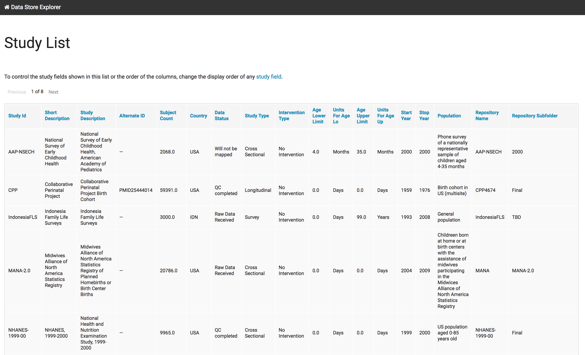

..  _study_list:

Study List
==========

The study list simply provides a tabular view of all the indexed
studies, which you can sort by any column header.

To configure which columns should appear in the study list see the
section on :ref:`configuring_study_fields`. By default, all columns
are included in the same order as in the uploaded file.
