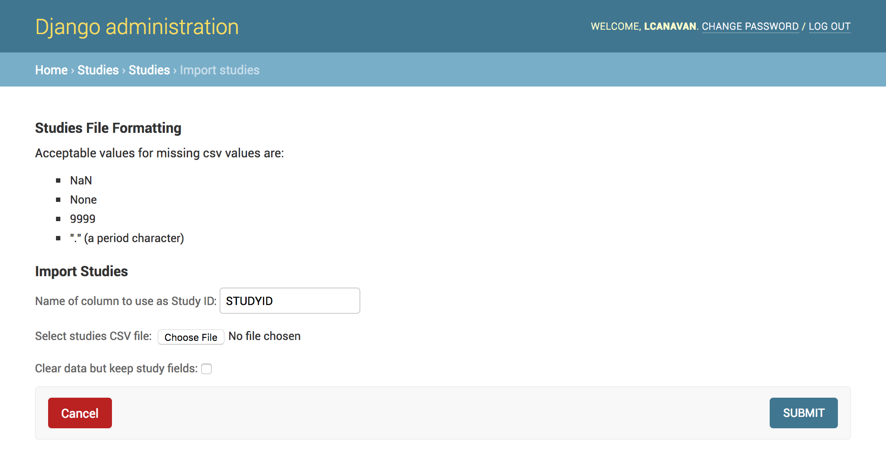
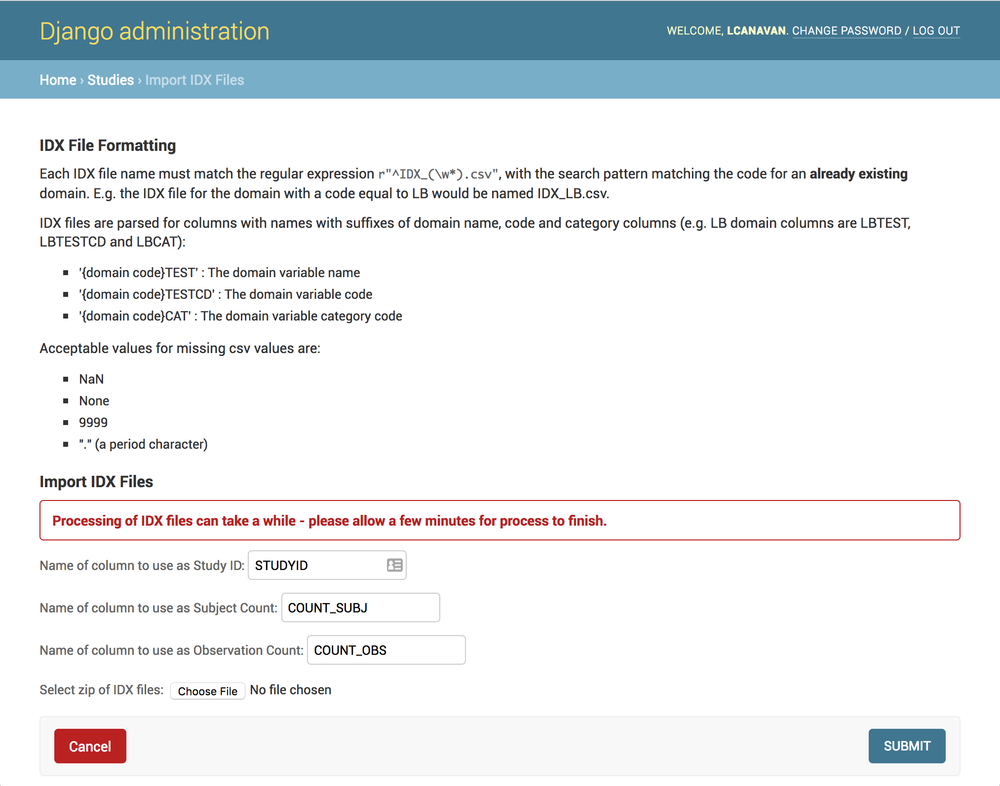
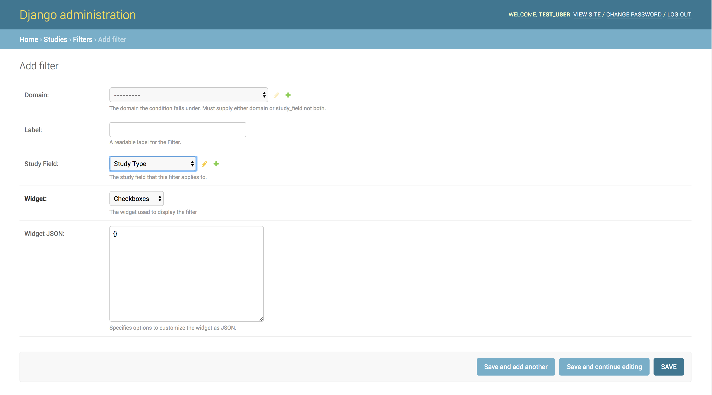
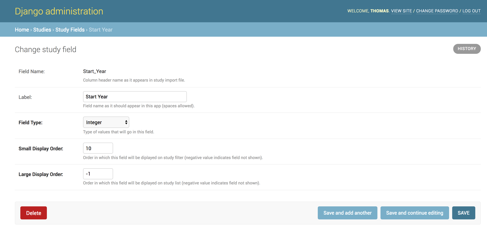

Admin Interface
---------------

The admin interface provides a UI for admins to configure the Study
Explorer and import new studies. It also allows modifying permissions
as well as viewing and modifying models.

Logging into the admin interface
================================

To access the admin interface simply add ``/admin/`` to the URL of the
data catalogue, e.g. when deployed locally on port 8000 you can simply
reach it by navigating to ``http://localhost:8000/admin/``. Once you
reach the page simply log in with the credentials you set up a
superuser (as described in the :ref:`create_superuser` section).

Once logged in you will see a view similar to this:

.. figure:: ../_static/images/admin_overview.png

    Study Explorer Administration page overview.

The Studies section shows all the models available for
modification. To view what each model does have a look at the
:ref:`models` section. With the appropriate permissions you can also
add new users and define permission groups. Finally, the admin
interface offers two buttons at the top to import new data.

Import data
===========

The Study Explorer provides convenient functionality to upload data
via the admin interface.

Study Index
+++++++++++

To import a CSV file containing all the studies we simply click on the
``Import studies`` button at the top of the Django Administration
page. This will bring up a form to upload the CSV file:

    Submission form to upload a new study index CSV file.

The first field should supply the column in the CSV file that
corresponds to the global study index and should match how the studies
are indexed in the study metadata files. Having defined the column you
can click on the ``Choose File`` button and select the CSV file to
upload using your OS's standard file browser. Finally you can declare
whether any previously loaded study fields should be retained or
whether it should just clear all the data.

Study Metadata
++++++++++++++

Before uploading the study metadata containing the various
observations associated with the studies we have to ensure domains are
defined.

.. _defining_domains:

Defining domains
****************

Domains define which variables the Study Explorer indexes and must
therefore be defined before the study metadata is imported. To add or
edit any particular model you can just select the model in the
``Studies`` section of the admin homepage. Once you have selected the
:ref:`domain` model you will be presented with a form like this, with
the option to ``Add Domain``:

.. figure:: ../_static/images/domain_model.png

    Admin overview of the :ref:`domain` model

Clicking that button will bring you to a view that lets you define a
new :ref:`domain`:

.. image:: ../_static/images/add_domain.png

A :ref:`domain` has three separate fields:

1) ``code``: A short code which should match the name of the metadata
   index file and the column headers in that file, e.g. defining
   ``LB`` as a code will ensure metadata files named ``IDX_LB.csv``
   will be processed and look for ``LBTEST``, ``LBTESTCD`` and
   ``LBSPEC`` columns in the file to extract and store the domain
   :ref:`variable` models.
2) ``label``: A longer label for the domain, which will be used to label
   the domain in a readable way on the website.
3) ``is_qualifier``: Declares whether the :ref:`domain` represents a
   qualifier providing additional information about an observation,
   e.g. a common qualifier might be the age category or the relatives
   an observation are associated with. Qualifiers should be declared
   as special columns in the metadata csv files.

Once you have defined these entries, just hit the ``Save``
button. Once you have defined all the domains that you want to process
you can upload the study metadata.

Uploading data
**************

In order to upload the study metadata you simply navigate back to the
admin overview and hit the ``Import IDX Files`` button, which will
bring you to another form:

    Upload form to import a zip-file of IDX csv files containing study metadata

There are three required columns in an IDX file, which are defined in the
upload form: the Study ID column, the Subject Count column, and the
Observation Count column. After declaring these, simply hit the ``Choose File``
button and select a zip file containing all the IDX csv files you want to
import. Once you hit save the form will clear the existing observations from
the database and process the zip file, repopulating the database with new
data. This process may take some time, during which the website will be
unresponsive.

.. _defining_filters:

Defining Filters
================

In order to begin using the :ref:`study_filter` we have to define the
variables that we actually want to filter on. The :ref:`filter` model
allows defining what to filter on and customize the widget associated
with the filter. In the :ref:`study_filter` the filters appear grouped
into ``Study metadata``, ``Qualifier metadata`` and ``Domain
metadata``.

To define a new :ref:`filter` navigate to the main admin page and then
click on :ref:`filter`. You should see an ``Add Filter`` button at the
top right. Once you are there you will see a form with a number of
fields:

Domain or Study Field
+++++++++++++++++++++

To define a new :ref:`Filter` select a :ref:`domain` or
:ref:`study_field` (not both) and then select the appropriate
``widget``. Currently you may choose on of three widgets, either
checkboxes, a double slider or a discrete slider. Checkboxes will
allow you to select multiple variables, the double slider will let you
a range in continuous space, while the discrete slider is useful for
selecting a range in a discrete set of ordered values. To see what
these widgets look like have a look at the :ref:`study_filter`
section.

Optional label
++++++++++++++

If you do not want to inherit the label from the :ref:`domain` or
:ref:`study_field` you can also supply a separate, custom label for
the :ref:`filter`.

Customizing widgets
+++++++++++++++++++

The :ref:`filter` model also allows defining some custom widget JSON,
which lets you customize the display of the range widgets in
particular. The range widgets are based on the `Ion Rangeslider
<http://ionden.com/a/plugins/ion.rangeSlider/en.html>`_ library, which
allows defining custom settings. Some of the more common options are
``"prettify_enabled": true``, which controls whether thousands are
separated by spaces, and ``"grid": true`` which shows ticks and values
all the way along the slider. However there are many more
customization options you can view by navigating to the settings
section on their website.

.. _configuring_study_fields:

Configuring Study Fields
========================

While the :ref:`study_field` models are created automatically when
import the study index, they provide options to control which fields
are displayed on the :ref:`study_filter` and :ref:`study_list` pages
respectively. Additionally you may specify the type of the data, which
is important when a field may contain numeric values, which can be
filtered on using a continuous slider, or for list types when a field
contains multiple entries you want to be able to filter on separately.
To begin configuring a :ref:`study_field` simply navigate to the
corresponding :ref:`study_field` model on the admin page. This will
bring up the list of existing study fields:

.. image:: ../_static/images/study_fields.png

Now you will be able to click on any of the existing entries to modify
them:

You now have the option of selecting between different field types,
including ``List``, ``Integer``, ``Character String`` and ``Decimal
number`` types. The numeric ``Integer`` and ``Decimal number`` types
are important to be able to filter using a :ref:`discrete_slider`
widget. The ``List`` type on the other hand is for fields that may
contain multiple values, in which case filtering will apply if the
filter matches any of the values in the list.

The ``Small display order`` field defines which fields are shown on
the :ref:`study_filter` page and in which order. To disable displaying
it simply set a negative integer, positive integers define an
ascending ordering. The same applies to the ``Large display order``
which defines which fields are shown in the :ref:`study_list` page.
